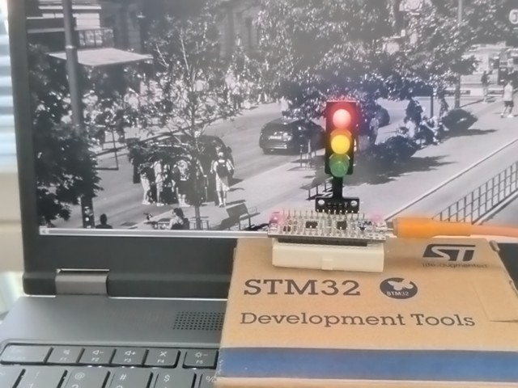

# L432 Traffic Light Project

This project implements a simple traffic light controller for the STM32L432KC microcontroller. It serves as a demonstration of a development workflow using **CLion**, the built-in **Serial Monitor**, and the [**Black Magic Probe**](https://black-magic.org/) debug probe.

## Features
- **Traffic Light Logic**: Cycles through RED, RED-YELLOW, GREEN, and YELLOW phases.
- **UART Diagnostics**: Prints the current phase to UART2 (115200 baud) using `printf`.
- **GPIO Control**: Drives LEDs corresponding to the traffic light phases.
- **Enhanced Debugging**: Recommended use of an **SVD file** for peripheral register inspection in CLion.

## Hardware Configuration
- **UART2**: Used for debug messages (TX: PA2, RX: PA15 on NUCLEO-L432KC as Virtual Com Port).
- **LED Pinouts**:
  - **RED**: PA12 (`SEM_RED_Pin`)
  - **YELLOW**: PB0 (`SEM_YELLOW_Pin`)
  - **GREEN**: PB7 (`SEM_GREEN_Pin`)

## Development Environment Setup
### STM32CubeCLT SVD File
For a better debugging experience in CLion, it is highly recommended to use the SVD (System View Description) file to inspect peripheral registers. If you have **STM32CubeCLT** installed, the SVD file for this MCU is located at `STMicroelectronics_CMSIS_SVD/STM32L432.svd`, relative to the STM32CubeCLT installation directory.

In CLion, during a debug session open the **Peripherals** tab in the Debug tool window, click **Load .svd file**, and select the file above. You can then pick which peripherals to display.

## Implementation Details
- The `printf` function is redirected to UART2 by overriding `__io_putchar` in [main.c](Core/Src/main.c)
- The main logic resides in [traffic_light.c](Core/Src/traffic_light.c)

## References

* [CLion + probe-rs](https://github.com/elmot/g491-traffic-light-rs-probe)
* CLion [Debug Servers](https://www.jetbrains.com/help/clion/debug-servers.html)
* [Black Magic Probe](https://black-magic.org/)
* CLion [Peripheral View](https://www.jetbrains.com/help/clion/peripheral-view.html)
* CLion [Serial Port Monitor](https://plugins.jetbrains.com/plugin/8031-serial-port-monitor)
